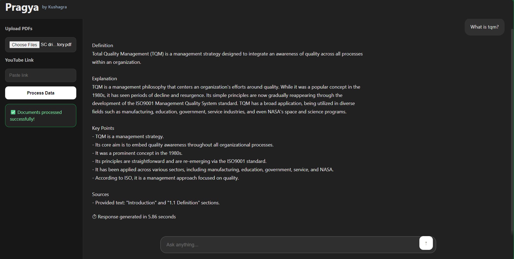
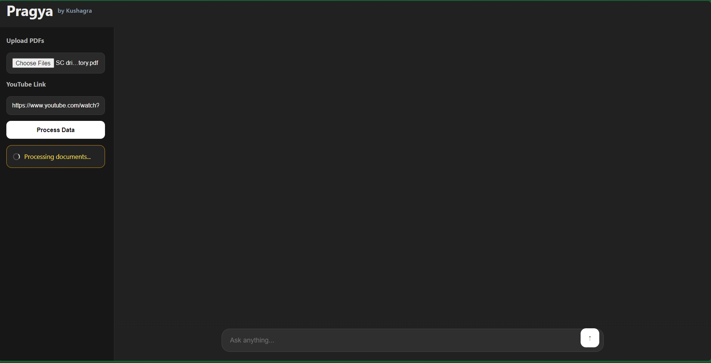
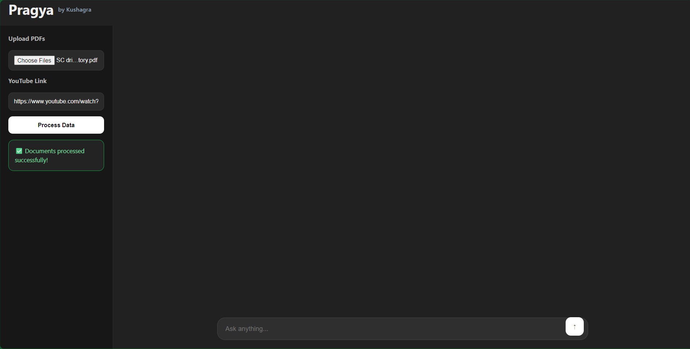

# 🧠 Pragya — AI-Powered Learning Assistant

> **Pragya** (Sanskrit: *wisdom*) is a personalized AI learning assistant that lets students interact with their own study material — PDFs and YouTube lectures — through natural, conversational question answering.

[](https://python.org)
[](https://fastapi.tiangolo.com)
[](https://langchain.com)
[](https://trychroma.com)
[](https://ai.google.dev)
[](LICENSE)

🔗 **Live Demo:** [Pragya on GitHub Pages](https://jainkushagra54.github.io/Pragya-RAG-Learning-Assistant)
⭐ **Backend:** Deployed on Render (US West)

---

## 📌 Overview

Instead of manually scrubbing through long PDFs or rewinding lecture videos, Pragya lets you upload your study material and ask questions in plain language. It retrieves the most relevant content from your own sources and generates grounded, context-aware answers.

No hallucinations from generic web knowledge. Just answers from *your* material.

---

## 🎯 Why I Built This

Every exam season I found myself juggling between PDFs, YouTube lectures, and search tabs trying to find one concept. Pragya unifies them into one AI-powered interface where you can upload your material, ask questions naturally, and get grounded answers — combining formal definitions from notes with intuitive explanations from lectures.

---

## ✨ Features (V1)

| Feature | Status |
|---|---|
| PDF Upload & Processing | ✅ |
| YouTube Transcript Ingestion via Supadata API | ✅ |
| Semantic Search via Vector Embeddings | ✅ |
| Context-Aware AI Answers | ✅ |
| Source-Aware Responses | ✅ |
| FastAPI Backend | ✅ |
| Responsive Chat-Style Frontend | ✅ |
| Real-Time Query Latency Tracking | ✅ |
| ChromaDB Vector Storage | ✅ |
| Google Gemini LLM Integration | ✅ |
| Dark-Themed Modern UI | ✅ |
| Deployed on GitHub Pages + Render | ✅ |

---

## ⚡ Performance

One of the most significant milestones of this project was a **~94% reduction in query latency**:

| Version | LLM Provider | Query Latency |
|---|---|---|
| V-1 (offline) | Ollama Mistral (local) | Varies by hardware |
| V0 | NVIDIA NIM API | ~76 seconds |
| V1 (current) | Google Gemini API | ~4.2–4.3 seconds |

**Same query. Same pipeline. 18× faster than NIM.**

> **Why the switch from NIM to Gemini?**
> NVIDIA NIM offered 40 requests/second throughput on paper, but real-world latency hit 76 seconds per query — unusable for a conversational interface. Migrating to **Google Gemini API** brought latency down to ~4.2 seconds.
>
> ⚠️ **Current Gemini limitation:** The free tier is capped at **20 requests/day**. For heavier usage, upgrade to a paid Gemini API plan.

---

## 🛠️ Tech Stack

### Backend
- **Python** — Core language
- **FastAPI** — REST API server
- **LangChain** — RAG orchestration
- **ChromaDB** — Vector database for semantic storage
- **Google Gemini API** — LLM for answer generation
- **Hugging Face Embeddings** — Vector embeddings via API
- **Supadata API** — YouTube transcript ingestion (bypasses cloud IP blocks)

### Frontend
- **HTML / CSS / JavaScript** — Responsive, dark-themed chat UI
- **GitHub Pages** — Frontend hosting

### Deployment
- **Render (US West)** — FastAPI backend hosting
- **GitHub Pages** — Static frontend hosting

### AI / NLP
- Retrieval-Augmented Generation (RAG)
- Text Embeddings
- Semantic Search
- Chunking Pipelines

---

## 🏗️ Architecture

```
User Question
      │
      ▼
Frontend (HTML/CSS/JS) — GitHub Pages
      │
      ▼
FastAPI Backend — Render (US West)
      │
      ▼
Embedding Search (ChromaDB)
      │
      ▼
Relevant Chunks Retrieved
      │
      ▼
Prompt Construction
      │
      ▼
Google Gemini LLM
      │
      ▼
Grounded Response Returned
```

---

## 📁 Project Structure

```
Pragya/
│
├── backend/
│   ├── chroma/                        # Vector database storage
│   ├── data/                          # Uploaded PDFs
│   │
│   ├── llm/
│   │   └── llm_client.py              # Gemini API integration
│   │
│   ├── rag/
│   │   ├── get_embedding_function.py  # Hugging Face embedding setup
│   │   ├── populatedb.py              # Chunk & embed pipeline
│   │   ├── query_data_llm.py          # RAG querying logic
│   │   ├── youtube_links.txt          # YouTube links storage
│   │   └── youtube_loader.py          # Supadata transcript ingestion
│   │
│   ├── .env                           # Environment variables (local)
│   ├── app.py                         # FastAPI server
│   └── requirements.txt
│
├── frontend/
│   ├── index.html
│   ├── script.js
│   └── style.css
│
├── screenshot/
│   ├── askingquestion.png
│   ├── processed.png
│   └── processing.png
│
└── README.md
```

---

## ⚙️ How It Works

### 1. Upload Content
- Upload one or more **PDF files** (notes, textbooks, slides)
- Paste **YouTube lecture links**

### 2. Processing Pipeline

**PDFs:**
1. Extract text from document
2. Split into semantic chunks
3. Generate vector embeddings via Hugging Face
4. Store in ChromaDB

**YouTube Videos:**
1. Fetch transcript via **Supadata API** (bypasses YouTube cloud IP restrictions)
2. Chunk transcript by word count
3. Generate vector embeddings
4. Store in ChromaDB

### 3. Query & Answer
1. User question is embedded
2. ChromaDB performs semantic similarity search
3. Top-k relevant chunks are retrieved
4. Chunks + question are sent to Gemini as a structured prompt
5. Gemini generates a grounded, source-aware response

---

## ⚠️ Important Notes on Deployment

### Ephemeral Storage
Render's free tier uses an **ephemeral filesystem** — the ChromaDB vector database is wiped every time the server restarts or spins down (after 15 minutes of inactivity).

**Recommended workflow:**
1. Upload all PDFs + YouTube links together in one session
2. Process everything at once
3. Ask your questions
4. For a fresh session — restart the Render service and re-upload

### YouTube Transcript Ingestion
Direct YouTube Transcript API calls are blocked on cloud provider IPs (AWS, GCP, Azure, Render, etc.). Pragya uses **Supadata API** to bypass this restriction.

---

## 🚀 Getting Started (Local)

### Prerequisites
- Python 3.10+
- A [Google Gemini API key](https://ai.google.dev)
- A [Hugging Face API token](https://huggingface.co/settings/tokens)
- A [Supadata API key](https://supadata.ai) (for YouTube transcripts)

### 1. Clone the Repository
```bash
git clone https://github.com/jainkushagra54/Pragya-RAG-Learning-Assistant.git
cd Pragya-RAG-Learning-Assistant
```

### 2. Create & Activate Virtual Environment
```bash
python -m venv venv

# Windows
venv\Scripts\activate

# Linux / macOS
source venv/bin/activate
```

### 3. Install Dependencies
```bash
pip install -r backend/requirements.txt
```

### 4. Configure Environment Variables

Create a `.env` file inside the `backend/` folder:
```env
API_KEY=YOUR_GEMINI_API_KEY
HF_TOKEN=YOUR_HUGGING_FACE_TOKEN
SUPADATA_API_KEY=YOUR_SUPADATA_API_KEY
```

### 5. Run the Backend
```bash
cd backend
uvicorn app:app --reload
```

Backend will be available at: `http://localhost:8000`

### 6. Launch the Frontend

Open `frontend/index.html` in your browser, or use the **VSCode Live Server** extension.

---

## 📸 Screenshots

### Asking a Question


### Processing Documents


### Processed Successfully


---

## 🧩 Challenges Faced

- **Memory limits** — PyTorch CUDA packages exceeded Render's 512MB free tier RAM; switched to Hugging Face Inference API
- **Region restrictions** — Google embedding API blocked in Singapore; moved Render service to US West region
- **YouTube IP blocks** — YouTube blocks all cloud provider IPs; integrated Supadata API as a workaround
- **CORS configuration** — `allow_credentials=True` is incompatible with `allow_origins=["*"]`; fixed by setting credentials to False
- **Ephemeral filesystem** — ChromaDB data wiped on every restart; documented workaround for demo usage
- **Silent errors** — Many deployment crashes had no visible traceback; used `python -c "import app"` to surface errors
- **Gemini API daily quota** — 20 requests/day on free tier
- **Port timeout** — Render's port scanner timing out before heavy models finished loading

---

## 🔮 Roadmap

### V2 — AI & Retrieval Upgrades
- [ ] Streaming responses (token-by-token output)
- [ ] Multi-LLM support (Gemini, GPT-4, Claude)
- [ ] Smarter adaptive chunking strategies
- [ ] Multimodal retrieval (images, graphs, tables from PDFs)
- [ ] Persistent vector storage with Pinecone

### V3 — Product Features
- [ ] Authentication system
- [ ] Per-user vector databases
- [ ] Persistent chat history
- [ ] Document management dashboard
- [ ] Support for PPT/PPTX, DOCX, Scanned PDFs (OCR)

### Performance
- [ ] Hybrid search (BM25 + semantic)
- [ ] Lower query latency (target: < 2s)
- [ ] Higher Gemini API quota

---

## 📚 Key Learnings

- Real-world RAG pipeline design and deployment
- Vector databases and embedding workflows
- Prompt engineering for grounded, source-faithful answers
- LLM API integration and quota management
- Production debugging — surfaces errors that never appear locally
- CORS, port binding, and cloud deployment constraints
- Ephemeral vs persistent storage in stateless deployments
- Bypassing cloud IP restrictions with third-party APIs

---

## 👤 Author

**Kushagra Jain**

Built as a personal project during exam season to solve a real problem — and ended up learning more from the deployment than from the code itself.

---

## 📄 License

This project is open-source and available under the [MIT License](LICENSE).
